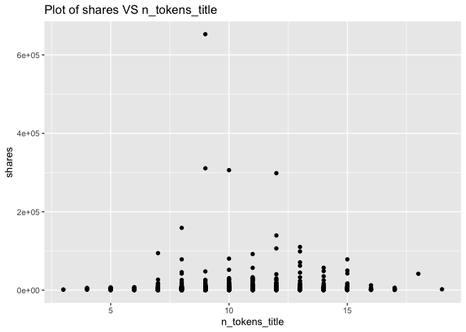
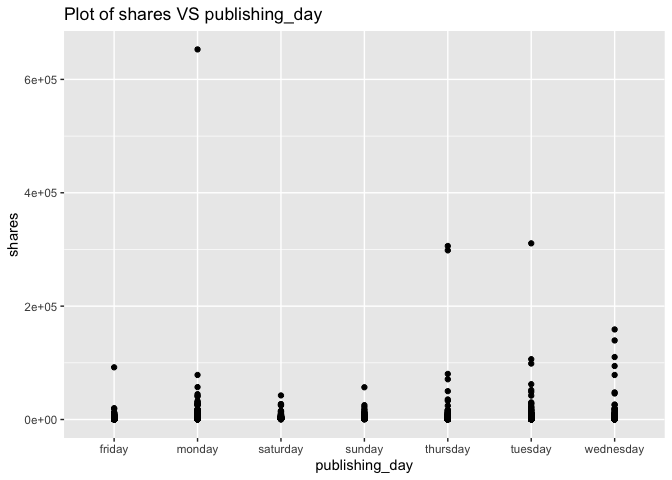
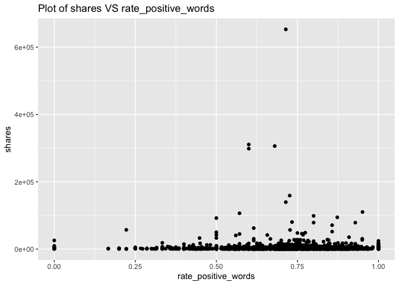
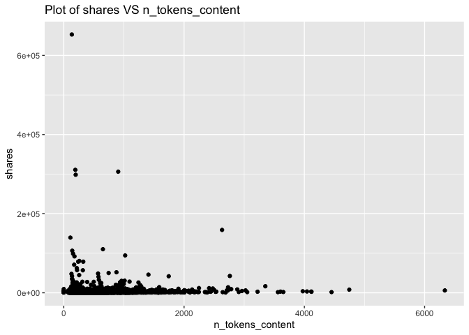
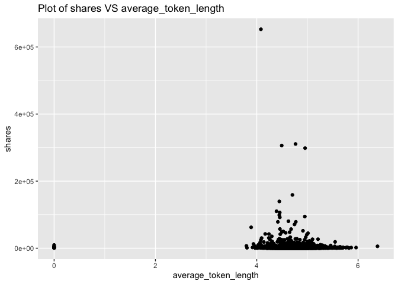
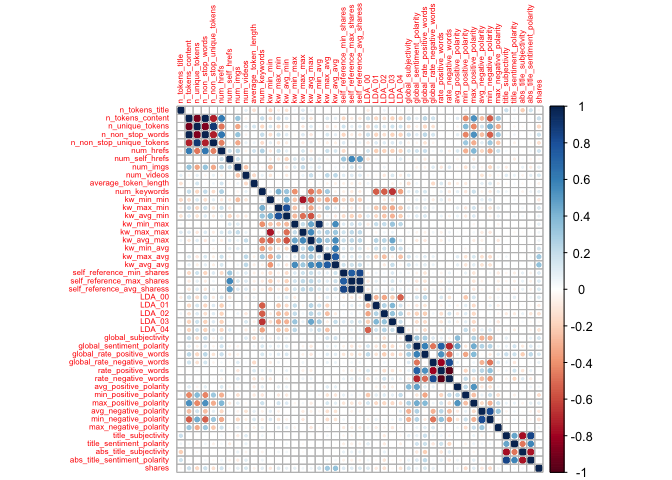

ST558 - Project 2
================
Li Wang & Bryan Bittner
2022-07-15

  - [Load Packages](#load-packages)
  - [Introduction](#introduction)
  - [Data](#data)
  - [Data Train/Test Split](#data-traintest-split)
  - [Summarizations](#summarizations)
      - [Data structure and basic summary
        statistics](#data-structure-and-basic-summary-statistics)
      - [Plots](#plots)
      - [Feature selection](#feature-selection)
  - [Modeling](#modeling)
      - [Linear Regression Model](#linear-regression-model)
      - [Random Forest Model](#random-forest-model)
      - [Boosted Tree Model](#boosted-tree-model)
  - [Comparison](#comparison)
  - [Automation](#automation)

``` r
rmarkdown::render("Project2.Rmd", 
                  output_format = "github_document",
                  output_file = "README.md",
                  output_options = list(html_preview= FALSE,toc=TRUE,toc_depth=2,toc_float=TRUE)
)
```

# Load Packages

We will use the following packages:

``` r
library(rmarkdown)
library(httr)
library(jsonlite)
library(readr)
library(tidyverse)
library(lubridate)
library(knitr)
library(caret)
library(randomForest)
library(corrplot)
library(gbm)
```

# Introduction

This [online News Popularity Data
Set](https://archive.ics.uci.edu/ml/datasets/Online+News+Popularity)
summarizes a heterogeneous set of features about articles published by
Mashable in a period of two years.

Our target variable is the shares variable(Number of shares ), and
predict variables are the following:

  - publishing\_day: Day of the article published
  - n\_tokens\_title: Number of words in the title
  - n\_tokens\_content: Number of words in the content
  - num\_self\_hrefs: Number of links to other articles published by
    Mashable
  - num\_imgs: Number of images
  - num\_videos: Number of videos
  - average\_token\_length: Average length of the words in the content
  - num\_keywords: Number of keywords in the metadata
  - kw\_avg\_min: Worst keyword (avg. shares)
  - kw\_avg\_avg: Avg. keyword (avg. shares)
  - self\_reference\_avg\_shares: Avg. shares of referenced articles in
    Mashable
  - LDA\_04: Closeness to LDA topic 4
  - global\_subjectivity: ext subjectivity
  - global\_rate\_positive\_words: Rate of positive words in the content
  - rate\_positive\_words: Rate of positive words among non-neutral
    tokens
  - avg\_positive\_polarity: Avg. polarity of positive words
  - min\_positive\_polarity: Min. polarity of positive words
  - avg\_negative\_polarity: Avg. polarity of negative words
  - max\_negative\_polarity: Max. polarity of negative words
  - title\_subjectivity: Title subjectivity

The purpose of our analysis is to predict the number of shares in social
networks (popularity). In this project, we produce some basic summary
statistics and plots about the training data, and fit a linear
regression model and an ensemble tree-based model.

# Data

Use a relative path to import the data.

``` r
newsData<-read_csv(file="../Datasets/OnlineNewsPopularity.csv",show_col_types = FALSE)
head(newsData)
```

Subset the data. If running the reports by an automated parameter driven
process, the report will automatically use the parameter passed into
this report. If running the report manually without a parameter, the
data will subset to the ‘lifestyle’ news channel.

``` r
#Read the parameter being passed in to the automated report
if (params$columnNames != "") {
  paramColumnNameType<-params$columnNames
}else{
  paramColumnNameType<-"lifestyle"
}
columnName<-paste("data_channel_is_",paramColumnNameType,sep="")
#According to dplyr help, to refer to column names stored as string, use the '.data' pronoun.
#https://dplyr.tidyverse.org/reference/filter.html
newsDataSubset <- filter(newsData,.data[[columnName]] == 1)
```

Merging the weekdays columns channels as one single column named
publishing\_day.

``` r
# Merging the weekdays columns channels as one single column named publishing_day
newsDataSubset <- newsDataSubset %>%
  select(url, starts_with("weekday_is")) %>%
  pivot_longer(-url) %>%
  dplyr::filter(value > 0) %>%
  mutate(publishing_day = gsub("weekday_is_", "", name)) %>%
  left_join(newsDataSubset, by = "url") %>%
  select(-name, -starts_with("weekday_is_"))
# set the publishing_day as factor variable
newsDataSubset$publishing_day<- as.factor(newsDataSubset$publishing_day)
head(newsDataSubset)
```

Here we drop some non-preditive variables:
url,value,timedelta,data\_channel\_is\_lifestyle,
data\_channel\_is\_entertainment,data\_channel\_is\_bus,
data\_channel\_is\_socmed
,data\_channel\_is\_tech,data\_channel\_is\_world columns,is\_weekend.
They won’t contribute anything.

``` r
newsDataSubset<-newsDataSubset%>%select(-c(1,2,4,16:21,34))
newsDataSubset
```

# Data Train/Test Split

Lets set up our Train/Test split. This will allow us to determine the
model fit using a subset of data called Training, while saving the
remainder of the data called Test to test our model predictions with.

``` r
set.seed(111)
train <- sample(1:nrow(newsDataSubset),size=nrow(newsDataSubset)*0.7)
test <- dplyr::setdiff(1:nrow(newsDataSubset),train)
newsDataSubsetTrain <- newsDataSubset[train,]
newsDataSubsetTest <- newsDataSubset[test,]
```

# Summarizations

## Data structure and basic summary statistics

Start with the data structure and basic summary statistics for the
‘shares’ field.

``` r
# data structure
str(newsDataSubsetTrain)
```

    ## tibble [4,380 × 46] (S3: tbl_df/tbl/data.frame)
    ##  $ publishing_day              : Factor w/ 7 levels "friday","monday",..: 5 5 1 7 2 5 1 7 6 5 ...
    ##  $ n_tokens_title              : num [1:4380] 12 9 9 9 6 11 14 8 9 8 ...
    ##  $ n_tokens_content            : num [1:4380] 128 719 427 232 85 ...
    ##  $ n_unique_tokens             : num [1:4380] 0.734 0.544 0.52 0.612 0.788 ...
    ##  $ n_non_stop_words            : num [1:4380] 1 1 1 1 1 ...
    ##  $ n_non_stop_unique_tokens    : num [1:4380] 0.887 0.717 0.759 0.756 0.925 ...
    ##  $ num_hrefs                   : num [1:4380] 8 10 5 5 2 3 1 5 9 8 ...
    ##  $ num_self_hrefs              : num [1:4380] 3 0 1 2 0 2 1 4 0 4 ...
    ##  $ num_imgs                    : num [1:4380] 1 1 1 1 0 0 0 1 1 1 ...
    ##  $ num_videos                  : num [1:4380] 1 0 0 0 1 1 1 0 0 0 ...
    ##  $ average_token_length        : num [1:4380] 5.01 4.87 4.64 4.7 4.72 ...
    ##  $ num_keywords                : num [1:4380] 10 10 5 3 7 6 3 5 10 5 ...
    ##  $ kw_min_min                  : num [1:4380] -1 4 217 4 217 4 -1 -1 -1 -1 ...
    ##  $ kw_max_min                  : num [1:4380] 573 1600 400 462 622 224 1.59 1.59 2700 630 ...
    ##  $ kw_avg_min                  : num [1:4380] 68.9 653.2 342.8 176.3 383 ...
    ##  $ kw_min_max                  : num [1:4380] 3400 0 0 2000 622 ...
    ##  $ kw_max_max                  : num [1:4380] 843300 690400 51900 843300 617900 ...
    ##  $ kw_avg_max                  : num [1:4380] 285580 155560 14800 511900 222646 ...
    ##  $ kw_min_avg                  : num [1:4380] 1125 0 0 1092 622 ...
    ##  $ kw_max_avg                  : num [1:4380] 4337 7275 2496 3317 4739 ...
    ##  $ kw_avg_avg                  : num [1:4380] 3156 3204 1360 2372 3079 ...
    ##  $ self_reference_min_shares   : num [1:4380] 887 0 1500 535 0 2800 47800 10800 0 1600 ...
    ##  $ self_reference_max_shares   : num [1:4380] 5400 0 1500 2000 0 2800 47800 10800 0 2700 ...
    ##  $ self_reference_avg_sharess  : num [1:4380] 2696 0 1500 1268 0 ...
    ##  $ LDA_00                      : num [1:4380] 0.92 0.127 0.84 0.4 0.357 ...
    ##  $ LDA_01                      : num [1:4380] 0.02 0.32 0.04 0.3995 0.0288 ...
    ##  $ LDA_02                      : num [1:4380] 0.02 0.1193 0.04 0.0667 0.2979 ...
    ##  $ LDA_03                      : num [1:4380] 0.02 0.0202 0.04 0.0667 0.2876 ...
    ##  $ LDA_04                      : num [1:4380] 0.02 0.4134 0.04 0.0667 0.0286 ...
    ##  $ global_subjectivity         : num [1:4380] 0.32 0.502 0.526 0.212 0.324 ...
    ##  $ global_sentiment_polarity   : num [1:4380] 0.02 0.1716 0.113 -0.0127 0.0542 ...
    ##  $ global_rate_positive_words  : num [1:4380] 0.00781 0.05841 0.03747 0.00431 0.08235 ...
    ##  $ global_rate_negative_words  : num [1:4380] 0.00781 0.01808 0.01171 0.01724 0.04706 ...
    ##  $ rate_positive_words         : num [1:4380] 0.5 0.764 0.762 0.2 0.636 ...
    ##  $ rate_negative_words         : num [1:4380] 0.5 0.236 0.238 0.8 0.364 ...
    ##  $ avg_positive_polarity       : num [1:4380] 0.5 0.402 0.346 0.35 0.281 ...
    ##  $ min_positive_polarity       : num [1:4380] 0.5 0.0333 0.1 0.35 0.0333 ...
    ##  $ max_positive_polarity       : num [1:4380] 0.5 1 0.8 0.35 0.7 ...
    ##  $ avg_negative_polarity       : num [1:4380] -0.4 -0.344 -0.305 -0.132 -0.302 ...
    ##  $ min_negative_polarity       : num [1:4380] -0.4 -1 -0.5 -0.167 -0.5 ...
    ##  $ max_negative_polarity       : num [1:4380] -0.4 -0.0714 -0.125 -0.05 -0.1667 ...
    ##  $ title_subjectivity          : num [1:4380] 0.25 0 0.8333 0.2889 0.0667 ...
    ##  $ title_sentiment_polarity    : num [1:4380] 0.25 0 0.5 -0.1556 0.0333 ...
    ##  $ abs_title_subjectivity      : num [1:4380] 0.25 0.5 0.333 0.211 0.433 ...
    ##  $ abs_title_sentiment_polarity: num [1:4380] 0.25 0 0.5 0.1556 0.0333 ...
    ##  $ shares                      : num [1:4380] 1200 823 535 783 3400 1800 2300 665 799 732 ...

``` r
# data summary
summary(newsDataSubsetTrain$shares)
```

    ##    Min. 1st Qu.  Median    Mean 
    ##       1     952    1400    3070 
    ## 3rd Qu.    Max. 
    ##    2500  652900

Now lets show the Mean, Median, Variance, and Standard Deviation. Notice
the Variance and Standard Deviation are both extremely high. This might
be something we will have to investigate further.

``` r
newsDataSubsetTrain %>% summarise(avg = mean(shares), med = median(shares), var = var(shares), sd = sd(shares))
```

Looking at the different columns in the dataset, there are two that
stand out. Generally speaking, people probably aren’t going to look at
articles that don’t have images or videos. Here are the summary stats
for the articles grouped on the number of images in the article.

``` r
newsDataSubsetTrain %>% group_by(num_imgs) %>%
summarise(avg = mean(shares), med = median(shares), var = var(shares), sd = sd(shares))
```

As we can see from the above table, the number of shares tend to
increase as the number of images increases. Therefore, the number of
images variable affects shares, and we will keep this variable.

Here are the summary stats for articles with videos.

``` r
newsDataSubsetTrain %>% group_by(num_videos) %>%
summarise(avg = mean(shares), med = median(shares), var = var(shares), sd = sd(shares))
```

As we can see from the above table, number of shares tend to increase as
the number of videos increases. Therefore, the number of videos variable
affects shares, and we will keep this variable.

## Plots

A plot with the number of shares on the y-axis and number of words in
the title (n\_tokens\_title) on the x-axis is created:

``` r
g <- ggplot(newsDataSubsetTrain, aes(x = n_tokens_title, y = shares))
g + geom_point()+labs(title = "Plot of shares VS n_tokens_title")
```

<!-- -->

The number of shares will vary depending on on the channel type. But
there is clearly a relationship between the number of words in the title
and the number of shares. Therefore, the number of words in the title
affects shares, and we will keep n\_tokens\_title variable.

A plot with the number of shares on the y-axis and publishing day
(publishing\_day) on the x-axis is created:

``` r
g <- ggplot(newsDataSubsetTrain, aes(x = publishing_day, y = shares))
g + geom_point()+labs(title = "Plot of shares VS publishing_day")
```

<!-- -->

Looking at the plot, some of the days will have a higher number of
shares and some of the days will have a lower number of shares. The days
with the higher shares will vary depending on the channel. For example,
it makes sense that some of the business related channels have a higher
share rate during the work week than the weekend. Therefore, the
publishing\_day affects shares, and we will keep publishing\_day.

A plot with the number of shares on the y-axis and rate of positive
words (rate\_positive\_words) on the x-axis is created:

``` r
g <- ggplot(newsDataSubsetTrain, aes(x = rate_positive_words, y = shares))
g + geom_point()+labs(title = "Plot of shares VS rate_positive_words")
```

<!-- -->

Looking across the plots for each of the channels, there is a
correlation between using positive words and a higher share number.
Therefore, the variable rate\_positive\_words effects shares, and we
will keep this variable.

A plot with the number of shares on the y-axis and number of words in
the content (n\_tokens\_content) on the x-axis is created:

``` r
g <- ggplot(newsDataSubsetTrain, aes(x = n_tokens_content, y = shares))
g + geom_point()+labs(title = "Plot of shares VS n_tokens_content")
```

<!-- -->

For each of the channel types, it is easy to see that the number of
shares will decrease as the number of words in the article increases.
For most channel types, the highest shares are with the articles that
have less than 2000 words. Therefore, the variable n\_tokens\_content
effects shares, and we will keep this variable.

A plot with the number of shares on the y-axis and average word length
(average\_token\_length) on the x-axis is created:

``` r
g <- ggplot(newsDataSubsetTrain, aes(x = average_token_length, y = shares))
g + geom_point()+labs(title = "Plot of shares VS average_token_length")
```

<!-- -->

From the above plot, we can see that the most shares contain 4-6 length
words. Therefore, the variable average\_token\_length effects shares,
and we will keep this variable.

Correlation matrix plot is generated:

``` r
newsDataSubsetTrain1<-select(newsDataSubsetTrain,-publishing_day)
corr=cor(newsDataSubsetTrain1, method = c("spearman"))
corrplot(corr,tl.cex=0.5)
```

<!-- -->

By the above correlation matrix plot, we can see these variables are
strongly correlated:

  - title\_subjectivity, abs\_title\_sentiment\_polarity,
    abs\_title\_subjectivity, title\_sentiment\_polarity
  - avg\_negative\_polarity, min\_negative\_polarity
  - max\_positive\_polarity, avg\_positive\_polarity
  - global\_rate\_negative\_words,
    rate\_negative\_words,rate\_positive\_words
  - global\_sentiment\_polarity, rate\_negative\_words,
    rate\_positive\_words
  - LDA\_03,LDA\_04
  - LDA\_00,LDA\_04
  - self\_reference\_max\_shares, self\_reference\_avg\_shares,
    self\_reference\_min\_shares
  - kw\_max\_avg, kw\_avg\_avg
  - kw\_min\_avg,kw\_avg\_avg,kw\_min\_max
  - kw\_avg\_max,kw\_avg\_avg,kw\_max\_max
  - kw\_avg\_min,kw\_avg\_max
  - kw\_max\_min,kw\_avg\_min,kw\_min\_min
  - kw\_min\_min,kw\_avg\_max
  - num\_keywords,LDA\_01
  - num\_keywords,LDA\_02
  - num\_hrefs, num\_imgs
  - n\_non\_stop\_unique\_tokens, num\_imgs
  - n\_non\_stop\_words, n\_non\_stop\_unique\_tokens
  - n\_unique\_tokens,n\_non\_stop\_unique\_tokens
  - n\_unique\_tokens, n\_non\_stop\_words, n\_tokens\_content
  - n\_tokens\_content, n\_non\_stop\_unique\_tokens
  - n\_tokens\_content, num\_hrefs

These are strongly correlated which makes us to assume that these
features are so linearly dependent that any one of the strong correlated
feature can be used and excluding the other features with high
correlation.

## Feature selection

Let’s do feature selection:

``` r
newsDataSubsetTrain2<-select(newsDataSubsetTrain,-abs_title_sentiment_polarity, -abs_title_subjectivity, -title_sentiment_polarity,-min_negative_polarity,-max_positive_polarity,-rate_negative_words,-global_rate_negative_words,-global_sentiment_polarity,-LDA_03,-LDA_00,-self_reference_max_shares,-self_reference_min_shares,-kw_max_avg,-kw_min_avg,-kw_min_max,-kw_avg_max,-kw_max_max,-kw_max_min,-kw_min_min,-LDA_01,-LDA_02,-num_hrefs,-n_non_stop_unique_tokens,-n_unique_tokens,-n_non_stop_words)
newsDataSubsetTest2<-select(newsDataSubsetTrain,-abs_title_sentiment_polarity, -abs_title_subjectivity, -title_sentiment_polarity,-min_negative_polarity,-max_positive_polarity,-rate_negative_words,-global_rate_negative_words,-global_sentiment_polarity,-LDA_03,-LDA_00,-self_reference_max_shares,-self_reference_min_shares,-kw_max_avg,-kw_min_avg,-kw_min_max,-kw_avg_max,-kw_max_max,-kw_max_min,-kw_min_min,-LDA_01,-LDA_02,-num_hrefs,-n_non_stop_unique_tokens,-n_unique_tokens,-n_non_stop_words)
```

# Modeling

## Linear Regression Model

A Linear Regression Model is the first model type we will look at. These
models are an intuitive way to investigate the linear relation between
multiple variables. These models make the estimation procedure simple
and easy to understand. Linear Regression models can come in all
different shapes and sizes and can be used to model more than just a
straight linear relationship. Regression models can be modified with
interactive and or higher order terms that will conform to a more
complex relationship.

For the first linear model example, we can try a model using just the
“num\_imgs” and “num\_videos” as our predictors.

``` r
set.seed(111)
#Fit a  multiple linear regression model using just the "num_imgs" and "num_videos" as our predictors. 
mlrFit <- train(shares ~ num_imgs + num_videos, 
                data = newsDataSubsetTrain2, 
                method="lm",
                trControl=trainControl(method="cv",number=5))
mlrFit
```

    ## Linear Regression 
    ## 
    ## 4380 samples
    ##    2 predictor
    ## 
    ## No pre-processing
    ## Resampling: Cross-Validated (5 fold) 
    ## Summary of sample sizes: 3504, 3504, 3505, 3503, 3504 
    ## Resampling results:
    ## 
    ##   RMSE      Rsquared     MAE     
    ##   12776.13  0.001289906  2755.481
    ## 
    ## Tuning parameter 'intercept' was
    ##  held constant at a value of TRUE

Next we can try a linear model using all of the fields as a predictor
variables.

``` r
#Fit a  multiple linear regression model using all of the fields as a predictor variables.
set.seed(111)
mlrAllFit <- train(shares ~ ., 
                data = newsDataSubsetTrain2, 
                method="lm",
                trControl=trainControl(method="cv",number=5))
mlrAllFit
```

    ## Linear Regression 
    ## 
    ## 4380 samples
    ##   20 predictor
    ## 
    ## No pre-processing
    ## Resampling: Cross-Validated (5 fold) 
    ## Summary of sample sizes: 3504, 3504, 3505, 3503, 3504 
    ## Resampling results:
    ## 
    ##   RMSE      Rsquared    MAE     
    ##   13004.96  0.02711116  2925.365
    ## 
    ## Tuning parameter 'intercept' was
    ##  held constant at a value of TRUE

Try a model using just the num\_imgs + num\_videos + kw\_avg\_avg +
num\_imgs\*kw\_avg\_avg as our predictors.

``` r
set.seed(111)
#Fit a  multiple linear regression model with num_imgs + num_videos + kw_avg_avg + num_imgs*kw_avg_avg. 
mlrInteractionFit <- train(shares ~ num_imgs + num_videos + kw_avg_avg + num_imgs*kw_avg_avg, 
                data = newsDataSubsetTrain2, 
                method="lm",
                trControl=trainControl(method="cv",number=5))
mlrInteractionFit
```

    ## Linear Regression 
    ## 
    ## 4380 samples
    ##    3 predictor
    ## 
    ## No pre-processing
    ## Resampling: Cross-Validated (5 fold) 
    ## Summary of sample sizes: 3504, 3504, 3505, 3503, 3504 
    ## Resampling results:
    ## 
    ##   RMSE     Rsquared     MAE     
    ##   12772.3  0.008891269  2695.487
    ## 
    ## Tuning parameter 'intercept' was
    ##  held constant at a value of TRUE

## Random Forest Model

The Random Forest Model is an example of an ensemble based model.
Instead of traditional decision trees, ensemble methods average across
the tree. This will greatly increase our prediction power, but it will
come at the expense of the easy interpretation from traditional decision
trees. The Random Forest based model will not use all available
predictors. Instead it will take a random subset of the predictors for
each tree fit and calculate the model fit for that subset. It will
repeat the process a pre-determined number of times and automatically
pick the best predictors for the model. This will end up creating a
reduction in the overall model variance.

``` r
set.seed(111)
randomForestFit <- train(shares ~ ., 
                         data = newsDataSubsetTrain2, 
                         method="rf",
                         preProcess=c("center","scale"),
                         trControl=trainControl(method="cv",number=5),
                         tuneGrid=data.frame(mtry=ncol(newsDataSubsetTrain)/3))
randomForestFit
```

    ## Random Forest 
    ## 
    ## 4380 samples
    ##   20 predictor
    ## 
    ## Pre-processing: centered (25),
    ##  scaled (25) 
    ## Resampling: Cross-Validated (5 fold) 
    ## Summary of sample sizes: 3504, 3504, 3505, 3503, 3504 
    ## Resampling results:
    ## 
    ##   RMSE      Rsquared    MAE     
    ##   13122.43  0.04238914  2968.024
    ## 
    ## Tuning parameter 'mtry' was
    ##  held constant at a value of 15.33333

## Boosted Tree Model

Boosted Regression Tree (BRT) models are a combination of two
techniques: decision tree algorithms and boosting methods. It repeatedly
fits many decision trees to improve the accuracy of the model.

Boosted Regression Tree uses the boosting method in which the input data
are weighted in subsequent trees. The weights are applied in such a way
that data that was poorly modelled by previous trees has a higher
probability of being selected in the new tree. This means that after the
first tree is fitted the model will take into account the error in the
prediction of that tree to fit the next tree, and so on. By taking into
account the fit of previous trees that are built, the model continuously
tries to improve its accuracy. This sequential approach is unique to
boosting.

``` r
set.seed(111)
BoostedTreeFit <- train(shares ~ ., 
                         data = newsDataSubsetTrain2,
                         distribution = "gaussian",
                         method="gbm",
                         trControl=trainControl(method="cv",number=5),
                         verbose = FALSE)
BoostedTreeFit
```

    ## Stochastic Gradient Boosting 
    ## 
    ## 4380 samples
    ##   20 predictor
    ## 
    ## No pre-processing
    ## Resampling: Cross-Validated (5 fold) 
    ## Summary of sample sizes: 3504, 3504, 3505, 3503, 3504 
    ## Resampling results across tuning parameters:
    ## 
    ##   interaction.depth  n.trees  RMSE    
    ##   1                   50      13047.90
    ##   1                  100      13116.13
    ##   1                  150      13097.85
    ##   2                   50      12906.62
    ##   2                  100      12990.48
    ##   2                  150      13072.54
    ##   3                   50      12975.39
    ##   3                  100      13081.60
    ##   3                  150      13095.29
    ##   Rsquared     MAE     
    ##   0.011457575  2866.980
    ##   0.012105047  2882.898
    ##   0.013573644  2885.496
    ##   0.010771167  2799.394
    ##   0.009301352  2856.998
    ##   0.008237519  2900.143
    ##   0.012060355  2869.802
    ##   0.011467309  2903.602
    ##   0.013766547  2921.912
    ## 
    ## Tuning parameter 'shrinkage' was
    ##  'n.minobsinnode' was held constant
    ##  at a value of 10
    ## RMSE was used to select the
    ##  optimal model using the
    ##  smallest value.
    ## The final values used for the
    ##  shrinkage = 0.1 and n.minobsinnode
    ##  = 10.

# Comparison

All the models are compared by RMSE on the test set

``` r
set.seed(111)
#compute RMSE of MlrFit
mlrFitPred <- predict(mlrFit, newdata = newsDataSubsetTest2)
MlrFit<-postResample(mlrFitPred, newsDataSubsetTest2$shares)
MlrFit.RMSE<-MlrFit[1]
#compute RMSE of MlrAllFit
MlrAllFitPred <- predict(mlrAllFit, newdata = newsDataSubsetTest2)
MlrAllFit<-postResample(MlrAllFitPred, newsDataSubsetTest2$shares)
MlrAllFit.RMSE<-MlrAllFit[1]
#compute RMSE of MlrInterFit
mlrInteractionFitPred <- predict(mlrInteractionFit, newdata = newsDataSubsetTest2)
MlrInterFit<-postResample(mlrInteractionFitPred, newsDataSubsetTest2$shares)
MlrInterFit.RMSE<-MlrInterFit[1]
#compute RMSE of RandomForest
ForestPred <- predict(randomForestFit, newdata = newsDataSubsetTest2)
RandomForest<-postResample(ForestPred, newsDataSubsetTest2$shares)
RandomForest.RMSE<-RandomForest[1]
#compute RMSE of BoostedTree
BoostPred <- predict(BoostedTreeFit, newdata = newsDataSubsetTest2)
BoostedTree<-postResample(BoostPred, newsDataSubsetTest2$shares)
BoostedTree.RMSE<-BoostedTree[1]
#Compare Root MSE values
c(MlrFit=MlrFit.RMSE,MlrAllFit=MlrAllFit.RMSE,MlrInterFit=MlrInterFit.RMSE,RandomForest=RandomForest.RMSE,BoostedTree=BoostedTree.RMSE)
```

    ##       MlrFit.RMSE    MlrAllFit.RMSE 
    ##         14130.477         13874.084 
    ##  MlrInterFit.RMSE RandomForest.RMSE 
    ##         14090.848          6389.653 
    ##  BoostedTree.RMSE 
    ##         13045.054

From the above compare, we can see the smallest RMSE is 5403.120 which
belong to RandomForest. Therefore, we will choose the Random Forest
Model.

# Automation

Below is a chuck of code that can be used to automate the reports. In
order to automate this project, the first thing we do is build a set of
parameters. These parameters match up with the column names from the
full news dataset. The program with read the parameter and subset the
data down to only values with the specified news channel name that is in
the parameter.

To automate the project for all of the different news channels, simply
execute the code chunk below directly to the console. Separate .md files
will then be created for each news channel type.

``` automate
#Add column names
columnNames <- data.frame("lifestyle","entertainment","bus","socmed","tech","world")
#Create filenames
output_file<-paste0(columnNames,".md")
#create a list for each column name
params = lapply(columnNames, FUN = function(x){list(columnNames = x)})
#put into a data frame
reports<-tibble(output_file,params)
#Render Code
apply(reports, MARGIN=1,FUN=function(x)
  {
    rmarkdown::render(input="Project2.Rmd",
    output_format="github_document",
    output_file=x[[1]],
    params=x[[2]],
    output_options = list(html_preview= FALSE,toc=TRUE,toc_depth=2,toc_float=TRUE)
    )
  }
)
```
